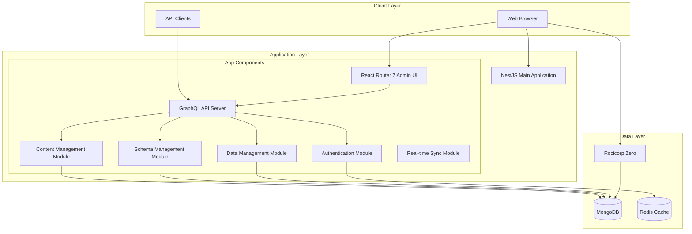
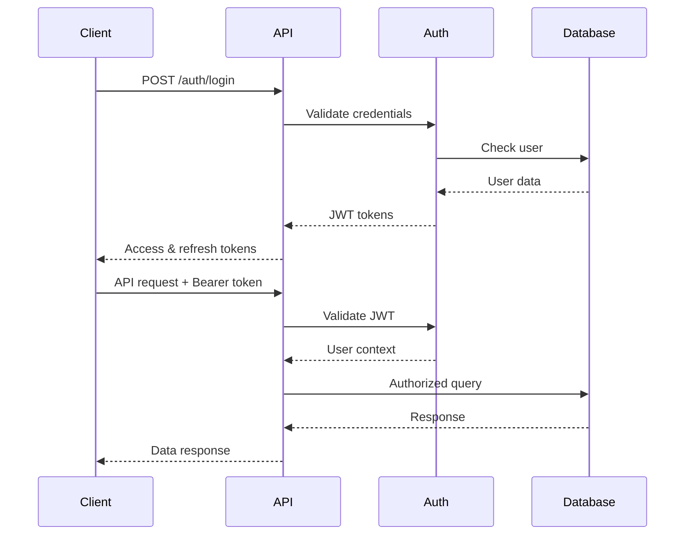

# Project Architecture & Technical Specifications
# Struktura

## 1. System Architecture Overview

### 1.1 High-Level Architecture

**Modular Monolith Design**: Single unified NestJS application with feature-based modules



### 1.2 Technology Stack

**Development Environment**
- **Node.js**: >=v22.13.1 required
- **Package Manager**: pnpm@10.17.1+ with workspaces
- **Build System**: Turborepo (v2.5.8+) for build caching and parallel task execution
- **Language**: TypeScript for type safety across all packages
- **Testing**: Vitest for testing with coverage support

**Application Layer**
- **Framework**: NestJS with modular monolith architecture
- **API**: GraphQL with Apollo Server + REST endpoints
- **Admin UI**: React Router 7 framework mode, mounted on NestJS Express router
- **Frontend Build**: Vite for frontend build tooling integrated with NestJS
- **Real-time**: WebSockets with Rocicorp Zero synchronization engine
- **Authentication**: JWT with refresh tokens

**Data Layer**
- **Database**: MongoDB 7+ with Mongoose ODM as primary data store
- **Caching**: Redis for sessions and real-time data
- **Real-time Sync**: Rocicorp Zero for live collaboration

**Development Tools**
- **Linting**: ESLint with custom shared configuration
- **Formatting**: Prettier for code formatting
- **Version Management**: Changesets for semantic versioning

**Infrastructure**
- **Containerization**: Docker with multi-stage builds
- **Development**: Docker Compose for local development
- **Monitoring**: OpenTelemetry + Prometheus metrics (OTEL-LGTM stack)

## 2. Database Design

### 2.1 Core Collections

**Workspaces Collection**
```typescript
interface Workspace {
  _id: ObjectId;
  name: string;
  slug: string;
  description?: string;
  owner: ObjectId; // User reference
  members: {
    user: ObjectId;
    role: 'owner' | 'admin' | 'editor' | 'viewer';
    invitedAt: Date;
    joinedAt?: Date;
  }[];
  settings: {
    timezone: string;
    dateFormat: string;
    numberFormat: string;
  };
  createdAt: Date;
  updatedAt: Date;
}
```

**Collections Collection (Schema Definitions)**
```typescript
interface Collection {
  _id: ObjectId;
  workspace: ObjectId;
  name: string;
  slug: string;
  description?: string;
  icon?: string;
  color?: string;
  schema: {
    fields: {
      id: string;
      name: string;
      type: FieldType;
      required: boolean;
      unique: boolean;
      validation?: ValidationRule[];
      options?: FieldOptions;
    }[];
    indexes: IndexDefinition[];
  };
  permissions: {
    read: Permission[];
    write: Permission[];
    delete: Permission[];
  };
  createdAt: Date;
  updatedAt: Date;
}
```

**Records Collection (Dynamic Data)**
```typescript
interface Record {
  _id: ObjectId;
  collection: ObjectId;
  workspace: ObjectId;
  data: {
    [fieldId: string]: any; // Dynamic based on schema
  };
  metadata: {
    createdBy: ObjectId;
    updatedBy: ObjectId;
    version: number;
    tags?: string[];
  };
  createdAt: Date;
  updatedAt: Date;
}
```

**Views Collection**
```typescript
interface View {
  _id: ObjectId;
  collection: ObjectId;
  workspace: ObjectId;
  name: string;
  type: 'grid' | 'card' | 'calendar' | 'kanban' | 'gallery';
  configuration: {
    filters: FilterRule[];
    sorts: SortRule[];
    groupBy?: string;
    columns?: ColumnConfig[];
    displayFields?: string[];
  };
  isPublic: boolean;
  shareToken?: string;
  createdBy: ObjectId;
  createdAt: Date;
  updatedAt: Date;
}
```

### 2.2 Field Types System

```typescript
enum FieldType {
  // Basic Types
  TEXT = 'text',
  NUMBER = 'number',
  BOOLEAN = 'boolean',
  DATE = 'date',
  DATETIME = 'datetime',
  
  // Rich Types
  EMAIL = 'email',
  URL = 'url',
  PHONE = 'phone',
  CURRENCY = 'currency',
  PERCENT = 'percent',
  
  // Selection Types
  SELECT = 'select',
  MULTISELECT = 'multiselect',
  
  // File Types
  ATTACHMENT = 'attachment',
  IMAGE = 'image',
  
  // Relationship Types
  REFERENCE = 'reference',
  LOOKUP = 'lookup',
  ROLLUP = 'rollup',
  
  // Advanced Types
  JSON = 'json',
  ARRAY = 'array',
  OBJECT = 'object',
  
  // Computed Types
  FORMULA = 'formula',
  AUTO_INCREMENT = 'autoIncrement',
  CREATED_TIME = 'createdTime',
  MODIFIED_TIME = 'modifiedTime',
  CREATED_BY = 'createdBy',
  MODIFIED_BY = 'modifiedBy'
}
```

### 2.3 Indexing Strategy

```typescript
// Performance indexes
db.records.createIndex({ "workspace": 1, "collection": 1 });
db.records.createIndex({ "workspace": 1, "collection": 1, "updatedAt": -1 });
db.records.createIndex({ "workspace": 1, "collection": 1, "metadata.createdBy": 1 });

// Full-text search
db.records.createIndex({ 
  "data.$**": "text",
  "metadata.tags": "text"
});

// Geospatial indexes for location fields
db.records.createIndex({ "data.location": "2dsphere" });
```

## 3. API Design

### 3.1 GraphQL Schema Structure

```graphql
type Workspace {
  id: ID!
  name: String!
  slug: String!
  description: String
  collections: [Collection!]!
  members: [WorkspaceMember!]!
  settings: WorkspaceSettings!
  createdAt: DateTime!
  updatedAt: DateTime!
}

type Collection {
  id: ID!
  name: String!
  slug: String!
  description: String
  schema: CollectionSchema!
  records(
    filter: RecordFilter
    sort: [SortInput!]
    limit: Int = 25
    offset: Int = 0
  ): RecordConnection!
  views: [View!]!
  permissions: CollectionPermissions!
  createdAt: DateTime!
  updatedAt: DateTime!
}

type Record {
  id: ID!
  collection: Collection!
  data: JSON!
  metadata: RecordMetadata!
  createdAt: DateTime!
  updatedAt: DateTime!
}

type CollectionSchema {
  fields: [Field!]!
  indexes: [IndexDefinition!]!
}

type Field {
  id: String!
  name: String!
  type: FieldType!
  required: Boolean!
  unique: Boolean!
  validation: [ValidationRule!]!
  options: FieldOptions
}
```

### 3.2 REST API Endpoints

```typescript
// Collections Management
GET    /api/v1/workspaces/:workspaceId/collections
POST   /api/v1/workspaces/:workspaceId/collections
GET    /api/v1/workspaces/:workspaceId/collections/:collectionId
PUT    /api/v1/workspaces/:workspaceId/collections/:collectionId
DELETE /api/v1/workspaces/:workspaceId/collections/:collectionId

// Records CRUD
GET    /api/v1/collections/:collectionId/records
POST   /api/v1/collections/:collectionId/records
GET    /api/v1/collections/:collectionId/records/:recordId
PUT    /api/v1/collections/:collectionId/records/:recordId
PATCH  /api/v1/collections/:collectionId/records/:recordId
DELETE /api/v1/collections/:collectionId/records/:recordId

// Bulk Operations
POST   /api/v1/collections/:collectionId/records/bulk-create
PUT    /api/v1/collections/:collectionId/records/bulk-update
DELETE /api/v1/collections/:collectionId/records/bulk-delete

// Schema Management
GET    /api/v1/collections/:collectionId/schema
PUT    /api/v1/collections/:collectionId/schema
POST   /api/v1/collections/:collectionId/fields
PUT    /api/v1/collections/:collectionId/fields/:fieldId
DELETE /api/v1/collections/:collectionId/fields/:fieldId

// Views
GET    /api/v1/collections/:collectionId/views
POST   /api/v1/collections/:collectionId/views
GET    /api/v1/views/:viewId
PUT    /api/v1/views/:viewId
DELETE /api/v1/views/:viewId
```

### 3.3 Real-Time Events

```typescript
interface RealtimeEvent {
  type: 'record.created' | 'record.updated' | 'record.deleted' | 
        'schema.updated' | 'collection.created' | 'view.updated';
  workspace: string;
  collection?: string;
  recordId?: string;
  data: any;
  userId: string;
  timestamp: Date;
}

// WebSocket Event Types
enum SocketEvents {
  // Connection
  CONNECT = 'connect',
  DISCONNECT = 'disconnect',
  JOIN_WORKSPACE = 'join:workspace',
  LEAVE_WORKSPACE = 'leave:workspace',
  
  // Data Events
  RECORD_CREATED = 'record:created',
  RECORD_UPDATED = 'record:updated',
  RECORD_DELETED = 'record:deleted',
  
  // Schema Events
  SCHEMA_UPDATED = 'schema:updated',
  FIELD_ADDED = 'field:added',
  FIELD_REMOVED = 'field:removed',
  
  // Collaboration
  USER_CURSOR = 'user:cursor',
  USER_TYPING = 'user:typing',
  COMMENT_ADDED = 'comment:added'
}
```

## 4. Security Architecture

### 4.1 Authentication Flow



### 4.2 Permission Model

```typescript
interface Permission {
  type: 'user' | 'role' | 'public';
  target?: ObjectId; // User ID for user permissions
  level: 'none' | 'read' | 'write' | 'admin' | 'owner';
  conditions?: {
    fields?: string[]; // Field-level permissions
    filter?: any; // Row-level security
  };
}

interface RolePermission {
  workspace: ObjectId;
  role: 'owner' | 'admin' | 'editor' | 'commenter' | 'viewer';
  permissions: {
    collections: Permission;
    records: Permission;
    views: Permission;
    members: Permission;
    settings: Permission;
  };
}
```

### 4.3 Data Validation

```typescript
interface ValidationRule {
  type: 'required' | 'minLength' | 'maxLength' | 'pattern' | 
        'min' | 'max' | 'email' | 'url' | 'custom';
  value?: any;
  message: string;
}

// Example field validation
const emailField: Field = {
  id: 'email',
  name: 'Email Address',
  type: FieldType.EMAIL,
  required: true,
  validation: [
    {
      type: 'required',
      message: 'Email is required'
    },
    {
      type: 'email',
      message: 'Must be a valid email address'
    },
    {
      type: 'maxLength',
      value: 255,
      message: 'Email must be less than 255 characters'
    }
  ]
};
```

## 5. Performance Considerations

### 5.1 Caching Strategy

```typescript
// Multi-layer caching approach
interface CacheConfig {
  // Browser cache for static assets
  browser: {
    assets: '1y',
    api: '5m',
    realtime: 'no-cache'
  };
  
  // CDN cache for public content
  cdn: {
    static: '1y',
    api: '1h',
    images: '30d'
  };
  
  // Redis cache for dynamic data
  redis: {
    sessions: '24h',
    records: '15m',
    schema: '1h',
    views: '30m'
  };
  
  // MongoDB query optimization
  database: {
    indexHints: true,
    aggregationCache: true,
    connectionPooling: true
  };
}
```

### 5.2 Query Optimization

```typescript
// Efficient record fetching with projections
class RecordsService {
  async getRecords(collectionId: string, options: QueryOptions) {
    const pipeline = [
      // Match stage
      { $match: { 
        collection: new ObjectId(collectionId),
        ...options.filter 
      }},
      
      // Lookup for referenced data
      ...this.buildLookupStages(options.include),
      
      // Project only requested fields
      { $project: this.buildProjection(options.fields) },
      
      // Sort and pagination
      { $sort: options.sort || { createdAt: -1 } },
      { $skip: options.offset || 0 },
      { $limit: options.limit || 25 }
    ];
    
    return this.recordModel.aggregate(pipeline);
  }
}
```

### 5.3 Real-Time Optimization

```typescript
// Efficient WebSocket message batching
class RealtimeService {
  private messageQueue = new Map<string, RealtimeEvent[]>();
  private flushInterval = 100; // ms
  
  queueMessage(workspaceId: string, event: RealtimeEvent) {
    if (!this.messageQueue.has(workspaceId)) {
      this.messageQueue.set(workspaceId, []);
      setTimeout(() => this.flushMessages(workspaceId), this.flushInterval);
    }
    
    this.messageQueue.get(workspaceId)!.push(event);
  }
  
  private flushMessages(workspaceId: string) {
    const messages = this.messageQueue.get(workspaceId) || [];
    if (messages.length > 0) {
      this.broadcastToWorkspace(workspaceId, {
        type: 'batch',
        events: messages
      });
    }
    this.messageQueue.delete(workspaceId);
  }
}
```

## 6. Deployment Architecture

### 6.1 Container Structure

```dockerfile
# Multi-stage Dockerfile
FROM node:22-alpine AS base
WORKDIR /app
COPY package*.json ./
RUN npm ci --only=production

FROM base AS development
RUN npm ci
COPY . .
EXPOSE 3000
CMD ["npm", "run", "dev"]

FROM base AS production
COPY --from=development /app/dist ./dist
EXPOSE 3000
CMD ["node", "dist/main.js"]
```

### 6.2 Docker Compose Configuration

```yaml
version: '3.8'

services:
  app:
    build: 
      context: .
      target: ${NODE_ENV:-development}
    ports:
      - "3000:3000"
    environment:
      - NODE_ENV=${NODE_ENV:-development}
      - DATABASE_URL=${DATABASE_URL}
      - REDIS_URL=${REDIS_URL}
    depends_on:
      - mongodb
      - redis

  mongodb:
    image: mongo:7
    ports:
      - "27017:27017"
    environment:
      - MONGO_INITDB_ROOT_USERNAME=${MONGO_USERNAME}
      - MONGO_INITDB_ROOT_PASSWORD=${MONGO_PASSWORD}
    volumes:
      - mongodb_data:/data/db

  redis:
    image: redis:7-alpine
    ports:
      - "6379:6379"
    command: redis-server --appendonly yes
    volumes:
      - redis_data:/data

  nginx:
    image: nginx:alpine
    ports:
      - "80:80"
      - "443:443"
    volumes:
      - ./nginx.conf:/etc/nginx/nginx.conf
      - ./ssl:/etc/ssl
    depends_on:
      - app

volumes:
  mongodb_data:
  redis_data:
```

### 6.3 Production Deployment

```yaml
# Kubernetes deployment example
apiVersion: apps/v1
kind: Deployment
metadata:
  name: struktura
spec:
  replicas: 3
  selector:
    matchLabels:
      app: struktura
  template:
    metadata:
      labels:
        app: struktura
    spec:
      containers:
      - name: app
        image: struktura:latest
        ports:
        - containerPort: 3000
        env:
        - name: NODE_ENV
          value: "production"
        - name: DATABASE_URL
          valueFrom:
            secretKeyRef:
              name: app-secrets
              key: database-url
        resources:
          requests:
            memory: "256Mi"
            cpu: "250m"
          limits:
            memory: "512Mi"
            cpu: "500m"
```