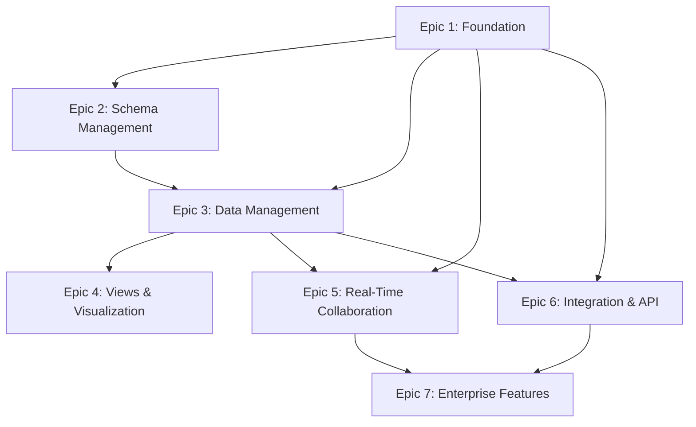

# Project Epics & User Stories
# Struktura

## Epic 1: Core Platform Foundation
**Duration**: 8-10 weeks  
**Team**: 2 Backend Developers, 1 DevOps Engineer  
**Priority**: Highest

### Epic Description
Establish the fundamental platform infrastructure including authentication, workspace management, and basic data operations. This epic creates the foundation that all other features will build upon.

### User Stories

#### 1.1 User Registration & Authentication
**Story**: As a new user, I want to create an account and securely access the platform so that I can start managing my data.

**Acceptance Criteria**:
- [ ] User can register with email/password
- [ ] Email verification process
- [ ] Login with email/password
- [ ] OAuth integration (Google, GitHub)
- [ ] Password reset functionality
- [ ] JWT token-based authentication
- [ ] Session management with refresh tokens

**Technical Tasks**:
- Set up NestJS authentication module
- Implement JWT strategy
- Create User schema and service
- Add OAuth providers
- Email service integration
- Rate limiting for auth endpoints

**Definition of Done**:
- All auth endpoints tested and documented
- Security audit passed
- Integration tests covering happy/sad paths
- API documentation updated

---

#### 1.2 Workspace Management
**Story**: As a user, I want to create and manage workspaces so that I can organize my projects and collaborate with teams.

**Acceptance Criteria**:
- [ ] Create new workspace with name and description
- [ ] Edit workspace settings
- [ ] Delete workspace (with confirmation)
- [ ] List user workspaces
- [ ] Switch between workspaces
- [ ] Workspace member management
- [ ] Role-based permissions (owner, admin, editor, viewer)

**Technical Tasks**:
- Create Workspace schema and service
- Implement RBAC system
- Add workspace invitation system
- Create workspace switching UI
- Add member management interface

**Definition of Done**:
- Workspace CRUD operations functional
- Permission system enforced
- UI components tested and accessible
- Database migrations created

---

#### 1.3 Basic Database Connection & Operations
**Story**: As a developer, I want a reliable connection to MongoDB with basic CRUD operations so that the platform can store and retrieve data efficiently.

**Acceptance Criteria**:
- [ ] MongoDB connection with connection pooling
- [ ] Basic CRUD operations for all entities
- [ ] Database indexing strategy
- [ ] Connection error handling and retries
- [ ] Database health monitoring
- [ ] Backup and restore procedures

**Technical Tasks**:
- Set up MongoDB with Mongoose
- Create base repository patterns
- Implement connection monitoring
- Add database migrations system
- Create backup scripts
- Set up monitoring dashboards

**Definition of Done**:
- Database performance benchmarks met
- All operations logged and monitored
- Backup/restore procedures tested
- Documentation complete

---

## Epic 2: Schema Management System
**Duration**: 6-8 weeks  
**Team**: 2 Frontend Developers, 1 Backend Developer  
**Priority**: High

### Epic Description
Build the visual schema builder and field management system that allows users to create and modify collection structures without technical expertise.

### User Stories

#### 2.1 Visual Collection Builder
**Story**: As a business user, I want to create collections using a drag-and-drop interface so that I can design my data structure without technical knowledge.

**Acceptance Criteria**:
- [ ] Drag-and-drop collection creation
- [ ] Visual field type selection
- [ ] Real-time schema preview
- [ ] Field configuration panels
- [ ] Schema validation and error display
- [ ] Template library for common schemas
- [ ] Import schema from existing data sources

**Technical Tasks**:
- Build drag-drop React components
- Create field type library
- Implement schema validation engine
- Add real-time preview system
- Create template management system
- Build schema import/export tools

**Definition of Done**:
- Intuitive UI tested with users
- All field types supported
- Schema validation comprehensive
- Templates functional and tested

---

#### 2.2 Dynamic Field Types System
**Story**: As a power user, I want to use advanced field types (relationships, lookups, formulas) so that I can create sophisticated data models.

**Acceptance Criteria**:
- [ ] Basic types (text, number, date, boolean)
- [ ] Selection types (single/multi-select)
- [ ] File attachment support
- [ ] Reference fields for relationships
- [ ] Lookup fields for cross-collection data
- [ ] Formula fields with expression builder
- [ ] Auto-generated fields (created/modified time/user)

**Technical Tasks**:
- Implement field type registry
- Build formula expression engine
- Create relationship management
- Add file upload service
- Build lookup query system
- Create auto-field generators

**Definition of Done**:
- All field types functional
- Formula engine tested extensively
- File uploads secure and scalable
- Relationship integrity maintained

---

#### 2.3 Schema Versioning & Migration
**Story**: As a user, I want to modify my collection schema without losing existing data so that my database can evolve with my needs.

**Acceptance Criteria**:
- [ ] Non-destructive schema changes
- [ ] Automatic data migration
- [ ] Schema version history
- [ ] Rollback capability
- [ ] Change impact analysis
- [ ] Migration status tracking

**Technical Tasks**:
- Build schema versioning system
- Create migration engine
- Add rollback functionality
- Build impact analysis tools
- Create migration monitoring
- Add change history UI

**Definition of Done**:
- Zero-downtime migrations
- Rollback tested and functional
- Migration history trackable
- Data integrity preserved

---

## Epic 3: Data Management Interface
**Duration**: 8-10 weeks  
**Team**: 2 Frontend Developers, 1 Backend Developer, 1 UX Designer  
**Priority**: High

### Epic Description
Create intuitive interfaces for data entry, editing, and management that feel familiar to spreadsheet users while supporting MongoDB's document flexibility.

### User Stories

#### 3.1 Grid View for Data Management
**Story**: As a user familiar with spreadsheets, I want a grid interface for managing my data so that I can efficiently enter and edit records.

**Acceptance Criteria**:
- [ ] Spreadsheet-like grid interface
- [ ] Inline editing with type validation
- [ ] Column sorting and filtering
- [ ] Row selection and bulk operations
- [ ] Keyboard navigation (arrow keys, tab)
- [ ] Column resizing and reordering
- [ ] Frozen columns for large datasets

**Technical Tasks**:
- Build virtual scrolling grid component
- Implement inline editing system
- Add sorting/filtering logic
- Create bulk operation handlers
- Add keyboard navigation
- Implement column management

**Definition of Done**:
- Performance tested with 10k+ rows
- Keyboard navigation fully functional
- All data types supported in grid
- Responsive design implemented

---

#### 3.2 Record Detail Forms
**Story**: As a user, I want detailed forms for complex records so that I can manage nested data and relationships effectively.

**Acceptance Criteria**:
- [ ] Auto-generated forms from schema
- [ ] Nested object/array editing
- [ ] File upload with preview
- [ ] Relationship field selectors
- [ ] Form validation with error messages
- [ ] Conditional field display
- [ ] Form templates and customization

**Technical Tasks**:
- Build dynamic form generator
- Create nested data editors
- Add file upload components
- Build relationship selectors
- Implement validation system
- Add conditional logic engine

**Definition of Done**:
- Forms generated for all field types
- Nested editing fully functional
- File handling secure and user-friendly
- Validation comprehensive and clear

---

#### 3.3 Import/Export Data Tools
**Story**: As a user, I want to import existing data and export my collections so that I can migrate from other tools and backup my work.

**Acceptance Criteria**:
- [ ] CSV import with field mapping
- [ ] JSON import/export
- [ ] Excel file import
- [ ] Data validation during import
- [ ] Error reporting and data cleaning
- [ ] Bulk import progress tracking
- [ ] Scheduled exports

**Technical Tasks**:
- Build file parsing engines
- Create field mapping interface
- Add validation pipeline
- Build progress tracking
- Create export scheduling
- Add error handling and reporting

**Definition of Done**:
- Large file imports handled efficiently
- All major formats supported
- Import errors clearly communicated
- Export scheduling functional

---

## Epic 4: Multiple Views & Visualization
**Duration**: 6-8 weeks  
**Team**: 2 Frontend Developers, 1 UX Designer  
**Priority**: Medium

### Epic Description
Implement different view types (calendar, kanban, gallery) that allow users to visualize and interact with their data in various ways depending on their workflow needs.

### User Stories

#### 4.1 Calendar View
**Story**: As a project manager, I want to view my records in a calendar format so that I can manage time-based data and schedules.

**Acceptance Criteria**:
- [ ] Month, week, and day calendar views
- [ ] Drag-and-drop event scheduling
- [ ] Multi-field date support
- [ ] Color coding by categories
- [ ] Event creation from calendar
- [ ] Recurring event support
- [ ] Calendar sharing and embedding

**Technical Tasks**:
- Integrate calendar component library
- Build event rendering system
- Add drag-drop functionality
- Create color coding system
- Implement recurring events
- Add sharing functionality

---

#### 4.2 Kanban Board View
**Story**: As a team lead, I want to organize my records in kanban columns so that I can track project progress and workflows.

**Acceptance Criteria**:
- [ ] Configurable column definitions
- [ ] Drag-and-drop between columns
- [ ] Card customization options
- [ ] Swimlanes for additional grouping
- [ ] WIP limits per column
- [ ] Progress tracking and metrics

**Technical Tasks**:
- Build kanban board component
- Add drag-drop between columns
- Create card customization system
- Implement swimlanes
- Add WIP limit enforcement
- Build progress analytics

---

#### 4.3 Gallery View for Media
**Story**: As a creative professional, I want to view my records as visual cards so that I can browse image-heavy collections effectively.

**Acceptance Criteria**:
- [ ] Responsive grid layout
- [ ] Image/file preview cards
- [ ] Customizable card templates
- [ ] Filtering and search overlay
- [ ] Lightbox for media viewing
- [ ] Bulk selection and operations

**Technical Tasks**:
- Build responsive gallery grid
- Create image optimization
- Add lightbox component
- Build card templating system
- Implement overlay controls
- Add bulk operations

**Definition of Done**:
- All views performant and responsive
- View switching seamless
- Customization options functional
- Mobile experience optimized

---

## Epic 5: Real-Time Collaboration
**Duration**: 8-10 weeks  
**Team**: 2 Backend Developers, 1 Frontend Developer  
**Priority**: Medium

### Epic Description
Enable real-time collaboration features including live editing, comments, and activity feeds so teams can work together efficiently.

### User Stories

#### 5.1 Live Editing & Synchronization
**Story**: As a team member, I want to see real-time updates when others edit data so that we can collaborate without conflicts.

**Acceptance Criteria**:
- [ ] Real-time data synchronization
- [ ] Conflict resolution for simultaneous edits
- [ ] User presence indicators
- [ ] Edit cursors and highlighting
- [ ] Offline support with sync on reconnect
- [ ] Change attribution and history

**Technical Tasks**:
- Implement WebSocket infrastructure
- Build operational transformation system
- Add presence tracking
- Create conflict resolution
- Build offline sync mechanism
- Add change tracking

---

#### 5.2 Comments & Discussions
**Story**: As a collaborator, I want to add comments to records and fields so that I can communicate context and feedback with my team.

**Acceptance Criteria**:
- [ ] Record-level comments
- [ ] Field-specific comments
- [ ] Comment threads and replies
- [ ] Mentions and notifications
- [ ] Comment resolution tracking
- [ ] Rich text formatting in comments

**Technical Tasks**:
- Build commenting system
- Add notification service
- Create mention functionality
- Build comment threading
- Add rich text editor
- Implement comment resolution

---

#### 5.3 Activity Feeds & Notifications
**Story**: As a workspace member, I want to see what's happening in my workspace so that I can stay informed about important changes.

**Acceptance Criteria**:
- [ ] Real-time activity feed
- [ ] Email notifications for important events
- [ ] In-app notification center
- [ ] Customizable notification preferences
- [ ] Activity filtering and search
- [ ] Mobile push notifications

**Technical Tasks**:
- Build activity tracking system
- Create notification service
- Add email notification system
- Build notification preferences
- Create mobile push service
- Add activity filtering

**Definition of Done**:
- Real-time features work reliably
- Notifications properly configured
- Collaboration flows tested
- Performance benchmarks met

---

## Epic 6: Integration & API Platform
**Duration**: 6-8 weeks  
**Team**: 2 Backend Developers, 1 Frontend Developer  
**Priority**: Medium

### Epic Description
Create comprehensive API access and third-party integrations so users can connect their data with external tools and automate workflows.

### User Stories

#### 6.1 REST API & GraphQL Endpoints
**Story**: As a developer, I want comprehensive API access so that I can integrate my data with external applications and build custom solutions.

**Acceptance Criteria**:
- [ ] Full CRUD REST API
- [ ] GraphQL query interface
- [ ] API key management
- [ ] Rate limiting and quotas
- [ ] API documentation with examples
- [ ] SDK libraries for popular languages
- [ ] Webhook subscriptions

**Technical Tasks**:
- Build comprehensive REST API
- Add GraphQL endpoint
- Implement API authentication
- Add rate limiting
- Create API documentation
- Build JavaScript SDK
- Implement webhook system

---

#### 6.2 Third-Party Integrations
**Story**: As a business user, I want to connect popular services to my workspace so that I can automate workflows and sync data.

**Acceptance Criteria**:
- [ ] Zapier integration
- [ ] Slack notifications and bot
- [ ] Google Workspace sync
- [ ] Email marketing tool connections
- [ ] Custom webhook endpoints
- [ ] OAuth app marketplace

**Technical Tasks**:
- Build Zapier integration
- Create Slack bot
- Add Google Workspace OAuth
- Build webhook management UI
- Create OAuth app framework
- Add integration marketplace

---

#### 6.3 Automation & Workflows
**Story**: As a power user, I want to create automated workflows so that repetitive tasks are handled automatically.

**Acceptance Criteria**:
- [ ] Trigger-based automation
- [ ] Multi-step workflow builder
- [ ] Conditional logic support
- [ ] Email and notification actions
- [ ] Data transformation functions
- [ ] Workflow monitoring and logs

**Technical Tasks**:
- Build workflow engine
- Create visual workflow builder
- Add condition evaluation
- Implement action library
- Build workflow monitoring
- Add debugging tools

**Definition of Done**:
- API fully documented and tested
- Major integrations functional
- Automation system reliable
- Performance requirements met

---

## Epic 7: Enterprise Features
**Duration**: 8-10 weeks  
**Team**: 1 Backend Developer, 1 Frontend Developer, 1 Security Engineer  
**Priority**: Low (Post-MVP)

### Epic Description
Add enterprise-grade features including advanced security, compliance, and administration capabilities for larger organizations.

### User Stories

#### 7.1 Advanced Authentication & SSO
**Story**: As an enterprise admin, I want to integrate with our identity provider so that users can access the platform with their corporate credentials.

**Acceptance Criteria**:
- [ ] SAML 2.0 SSO integration
- [ ] Active Directory/LDAP sync
- [ ] Multi-factor authentication
- [ ] Session timeout policies
- [ ] IP allowlisting
- [ ] Audit logging for security events

---

#### 7.2 Advanced Permissions & Governance
**Story**: As a compliance officer, I want granular access controls and audit trails so that we can maintain data governance and regulatory compliance.

**Acceptance Criteria**:
- [ ] Field-level permissions
- [ ] Row-level security rules
- [ ] Data classification and labeling
- [ ] Comprehensive audit logs
- [ ] Data retention policies
- [ ] GDPR compliance tools

---

#### 7.3 Performance & Scalability
**Story**: As a platform administrator, I want the system to handle our organization's scale so that performance remains consistent as we grow.

**Acceptance Criteria**:
- [ ] Horizontal scaling support
- [ ] Database sharding strategies
- [ ] CDN integration for global performance
- [ ] Advanced caching layers
- [ ] Performance monitoring and alerting
- [ ] Capacity planning tools

**Definition of Done**:
- Enterprise features tested at scale
- Security audit completed
- Compliance requirements verified
- Performance benchmarks exceeded

---

## Cross-Epic Dependencies

### Critical Path Analysis

### Resource Allocation Timeline
- **Weeks 1-8**: Epic 1 (Foundation) - Full team focus
- **Weeks 6-14**: Epic 2 (Schema Management) - Overlap with Epic 1
- **Weeks 10-20**: Epic 3 (Data Management) - Core feature development
- **Weeks 16-24**: Epic 4 (Views) + Epic 5 (Collaboration) - Parallel development
- **Weeks 20-28**: Epic 6 (Integration & API) - Platform completion
- **Weeks 24-34**: Epic 7 (Enterprise) - Post-MVP enhancement

### Risk Mitigation
- **Technical Risk**: Build MVP with core features first, add complexity gradually
- **Resource Risk**: Cross-train team members on critical components
- **Timeline Risk**: Prioritize features based on user feedback and market needs
- **Quality Risk**: Implement automated testing and CI/CD from Epic 1