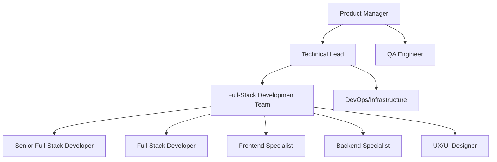

# Team Roles & Responsibilities
# Struktura Project

## 1. Team Organization Structure

### 1.1 Team Composition (9 Members)

### 1.2 Reporting Structure
- **Product Manager**: Overall project coordination and stakeholder communication
- **Technical Lead**: Technical decisions and architecture oversight
- **Team Leads**: Day-to-day development coordination within their domains
- **Individual Contributors**: Feature development and implementation

## 2. Detailed Role Definitions

### 2.1 Product Manager
**Name**: [To be assigned]  
**Commitment**: Full-time  
**Reports to**: Project Stakeholders

#### Primary Responsibilities
- **Product Strategy**: Define product vision, roadmap, and feature prioritization
- **Stakeholder Management**: Communicate with business stakeholders and gather requirements
- **User Research**: Conduct user interviews, surveys, and feedback analysis
- **Project Coordination**: Coordinate cross-team efforts and manage project timeline
- **Market Analysis**: Monitor competitors and market trends

#### Key Deliverables
- Product Requirements Document (PRD)
- Sprint planning and backlog management
- User story creation and acceptance criteria
- Regular stakeholder updates and demos
- Go-to-market strategy and launch planning

#### Success Metrics
- On-time delivery of project milestones
- User satisfaction scores
- Feature adoption rates
- Clear and actionable requirements

---

### 2.2 Technical Lead
**Name**: [To be assigned]  
**Commitment**: Full-time  
**Reports to**: Product Manager

#### Primary Responsibilities
- **Architecture Design**: Define system architecture and technical standards
- **Technology Decisions**: Choose frameworks, libraries, and development approaches
- **Code Quality**: Establish coding standards and review critical code changes
- **Team Mentoring**: Guide junior developers and conduct technical training
- **Technical Risk Management**: Identify and mitigate technical risks

#### Key Deliverables
- Technical architecture documentation
- Development standards and guidelines
- Code review approval for major changes
- Technical feasibility assessments
- Performance and scalability planning

#### Success Metrics
- System performance benchmarks
- Code quality metrics (coverage, complexity)
- Team productivity and velocity
- Technical debt management

#### Technical Skills Required
- 7+ years experience with Node.js/TypeScript
- Experience with MongoDB and database design
- Familiarity with React and modern frontend frameworks
- DevOps and infrastructure knowledge
- System design and architecture experience

---

### 2.3 Senior Full-Stack Developer
**Name**: [To be assigned]  
**Commitment**: Full-time  
**Reports to**: Technical Lead

#### Primary Responsibilities
- **Full-Stack Development**: Work on unified NestJS application with integrated React Router 7 admin UI
- **API Development**: Design and implement GraphQL APIs within the main application
- **Database Design**: Create efficient MongoDB schemas and queries
- **Frontend Integration**: Ensure seamless integration between backend services and React Router 7 UI
- **Authentication & Security**: Implement authentication, authorization, and security features
- **Performance Optimization**: Optimize both backend and frontend performance

#### Key Deliverables
- Unified application architecture with NestJS and React Router 7
- User authentication and workspace management systems
- Schema management and validation engine
- Real-time synchronization infrastructure
- Integrated admin interface with backend APIs
- API documentation and testing

#### Success Metrics
- API response time < 200ms for 95% of requests
- 99.9% uptime for core services
- Comprehensive API test coverage
- Security audit compliance

#### Technical Skills Required
- 5+ years Node.js/TypeScript experience
- Advanced MongoDB and Mongoose knowledge
- GraphQL and REST API development
- WebSocket and real-time systems
- Authentication and security best practices

---

### 2.4 Backend Developer
**Name**: [To be assigned]  
**Commitment**: Full-time  
**Reports to**: Technical Lead

#### Primary Responsibilities
- **Feature Implementation**: Build backend features according to specifications
- **Data Processing**: Implement import/export and data transformation features
- **Testing**: Write unit and integration tests for backend code
- **Bug Fixes**: Resolve backend issues and performance problems
- **Documentation**: Document APIs and backend processes

#### Key Deliverables
- Import/export functionality for CSV, JSON, Excel
- Data validation and transformation pipelines
- Background job processing system
- Email and notification services
- Backup and recovery procedures

#### Success Metrics
- Feature completion within sprint timelines
- Test coverage > 80% for new code
- Bug resolution within SLA timeframes
- Clear and complete documentation

#### Technical Skills Required
- 3+ years Node.js/TypeScript experience
- MongoDB and database query optimization
- File processing and data transformation
- Email and notification systems
- Testing frameworks (Jest, Supertest)

---

### 2.5 Senior Frontend Developer
**Name**: [To be assigned]  
**Commitment**: Full-time  
**Reports to**: Technical Lead

#### Primary Responsibilities
- **UI Architecture**: Design component architecture and state management
- **Advanced Features**: Implement complex UI features like real-time editing and multiple views
- **Performance Optimization**: Optimize frontend performance and user experience
- **Component Library**: Build and maintain shared UI component library
- **Frontend Standards**: Establish frontend coding standards and best practices

#### Key Deliverables
- React component library and design system
- Real-time collaboration features
- Advanced data visualization (calendar, kanban, gallery views)
- Performance optimizations and caching
- Frontend testing infrastructure

#### Success Metrics
- Page load times < 2 seconds
- Interactive response times < 100ms
- Component reusability across features
- Accessibility compliance (WCAG 2.1 AA)

#### Technical Skills Required
- 5+ years React/TypeScript experience
- Advanced state management (Redux, Zustand)
- Real-time UI with WebSockets
- CSS frameworks and responsive design
- Frontend testing (Jest, React Testing Library, Playwright)

---

### 2.6 Frontend Developer
**Name**: [To be assigned]  
**Commitment**: Full-time  
**Reports to**: Technical Lead

#### Primary Responsibilities
- **UI Implementation**: Build user interfaces according to design specifications
- **Form Development**: Create dynamic forms and data entry interfaces
- **Integration**: Connect frontend with backend APIs
- **Testing**: Write frontend unit and integration tests
- **Browser Compatibility**: Ensure cross-browser compatibility and responsive design

#### Key Deliverables
- Schema builder and collection management interfaces
- Data grid and record management components
- Import/export wizards and data mapping tools
- User authentication and workspace management UI
- Mobile-responsive layouts

#### Success Metrics
- UI components match design specifications
- Cross-browser compatibility verified
- Mobile responsiveness on all major devices
- Accessibility standards compliance

#### Technical Skills Required
- 3+ years React/TypeScript experience
- CSS/Tailwind CSS proficiency
- Form validation and user input handling
- API integration and error handling
- Responsive design principles

---

### 2.7 UX/UI Designer
**Name**: [To be assigned]  
**Commitment**: Full-time  
**Reports to**: Product Manager

#### Primary Responsibilities
- **User Experience Design**: Create user flows, wireframes, and prototypes
- **Visual Design**: Design consistent visual elements and brand identity
- **User Research**: Conduct usability testing and user interviews
- **Design System**: Create and maintain design system and component library
- **Collaboration**: Work closely with developers to ensure design implementation

#### Key Deliverables
- Complete design system and style guide
- User flow diagrams and wireframes
- High-fidelity mockups and prototypes
- Usability testing reports and recommendations
- Design specifications for development team

#### Success Metrics
- User satisfaction scores from usability testing
- Design-to-development consistency
- Accessibility compliance in designs
- User task completion rates

#### Skills Required
- 4+ years UX/UI design experience
- Proficiency in Figma, Sketch, or similar tools
- User research and usability testing experience
- Understanding of web accessibility standards
- Experience with design systems and component libraries

---

### 2.8 DevOps Engineer
**Name**: [To be assigned]  
**Commitment**: Full-time  
**Reports to**: Technical Lead

#### Primary Responsibilities
- **Infrastructure Management**: Set up and maintain development and production environments
- **CI/CD Pipeline**: Build automated testing, building, and deployment pipelines
- **Monitoring & Logging**: Implement system monitoring, logging, and alerting
- **Security**: Ensure security best practices in deployment and infrastructure
- **Performance Monitoring**: Monitor application performance and optimize infrastructure

#### Key Deliverables
- Docker containerization for all services
- Kubernetes deployment configurations
- CI/CD pipeline with GitHub Actions
- Monitoring dashboard with Prometheus/Grafana
- Backup and disaster recovery procedures

#### Success Metrics
- 99.9% system uptime
- Deployment frequency and success rate
- Mean time to recovery (MTTR) < 1 hour
- Infrastructure cost optimization

#### Technical Skills Required
- 4+ years DevOps/infrastructure experience
- Docker and Kubernetes expertise
- CI/CD pipeline development
- Cloud platforms (AWS, GCP, or Azure)
- Monitoring and logging tools

---

### 2.9 QA Engineer
**Name**: [To be assigned]  
**Commitment**: Full-time  
**Reports to**: Technical Lead

#### Primary Responsibilities
- **Test Planning**: Create comprehensive test plans and test cases
- **Manual Testing**: Perform manual testing of features and user flows
- **Test Automation**: Build and maintain automated test suites
- **Bug Tracking**: Identify, document, and track bugs through resolution
- **Quality Assurance**: Ensure features meet quality standards before release

#### Key Deliverables
- Comprehensive test plans for all features
- Automated test suites for critical user flows
- Bug reports with clear reproduction steps
- Quality metrics and testing reports
- User acceptance testing coordination

#### Success Metrics
- Bug escape rate < 5%
- Test coverage > 80% for critical paths
- Automated test execution time optimization
- User acceptance testing success rate

#### Technical Skills Required
- 3+ years QA/testing experience
- Test automation tools (Playwright, Cypress)
- Bug tracking and test management tools
- Understanding of web technologies
- API testing experience

---

### 2.10 Full-Stack Developer (Support Role)
**Name**: [To be assigned]  
**Commitment**: Full-time  
**Reports to**: Technical Lead

#### Primary Responsibilities
- **Cross-Team Support**: Assist both frontend and backend teams as needed
- **Integration Work**: Handle complex integrations between frontend and backend
- **Prototyping**: Build quick prototypes and proof-of-concepts
- **Documentation**: Create technical documentation and developer guides
- **Maintenance**: Handle bug fixes and maintenance tasks across the stack

#### Key Deliverables
- Integration between major system components
- Developer documentation and guides
- Prototype implementations for new features
- Cross-platform compatibility testing
- Emergency bug fixes and hotfixes

#### Success Metrics
- Quick turnaround on support requests
- High-quality integration implementations
- Comprehensive documentation coverage
- Effective prototyping and validation

#### Technical Skills Required
- 4+ years full-stack development experience
- Proficiency in both React and Node.js
- MongoDB and frontend state management
- API design and integration
- Strong problem-solving and debugging skills

## 3. Communication & Collaboration

### 3.1 Meeting Schedule
- **Daily Standups**: 15 minutes, 9:00 AM (entire team)
- **Sprint Planning**: 2 hours, every 2 weeks (entire team)
- **Sprint Review**: 1 hour, end of each sprint (entire team + stakeholders)
- **Retrospectives**: 1 hour, end of each sprint (entire team)
- **Technical Architecture Review**: 1 hour weekly (technical team)
- **Design Review**: 1 hour weekly (design + frontend team)

### 3.2 Communication Tools
- **Slack**: Daily communication and quick discussions
- **Zoom**: Video meetings and pair programming sessions
- **GitHub**: Code collaboration, reviews, and project management
- **Figma**: Design collaboration and handoffs
- **Notion**: Documentation and knowledge sharing

### 3.3 Code Collaboration
- **Branch Strategy**: GitFlow with feature branches
- **Code Reviews**: Required for all changes, minimum 1 approval
- **Pair Programming**: Encouraged for complex features
- **Architecture Discussions**: Weekly reviews for major changes

## 4. Onboarding & Training

### 4.1 New Team Member Onboarding (Week 1)
- **Day 1**: Project overview, team introductions, environment setup
- **Day 2-3**: Codebase walkthrough, architecture training
- **Day 4-5**: First small task assignment and mentoring

### 4.2 Skill Development
- **Technical Training**: Monthly lunch-and-learn sessions
- **Conference Budget**: $2,000 per person annually
- **Book/Course Budget**: $500 per person annually
- **Internal Knowledge Sharing**: Weekly tech talks

### 4.3 Performance Reviews
- **Quarterly Reviews**: Goal setting and progress evaluation
- **Annual Reviews**: Comprehensive performance assessment
- **Continuous Feedback**: Weekly 1:1s with direct reports

## 5. Success Criteria & Team KPIs

### 5.1 Individual Performance Metrics
- **Velocity**: Story points completed per sprint
- **Quality**: Bug rate and code review feedback
- **Collaboration**: Participation in code reviews and knowledge sharing
- **Innovation**: Contribution of ideas and process improvements

### 5.2 Team Performance Metrics
- **Delivery**: On-time delivery of sprint commitments
- **Quality**: Overall bug rate and customer satisfaction
- **Velocity**: Consistent and predictable sprint velocity
- **Knowledge Sharing**: Documentation quality and team learning

### 5.3 Project Success Metrics
- **Timeline**: Deliver MVP within 3 months
- **Quality**: Maintain >95% uptime and <200ms API response times
- **User Satisfaction**: Achieve >4.5/5 user satisfaction rating
- **Team Satisfaction**: Maintain >85% team satisfaction scores

This team structure provides clear roles, responsibilities, and success metrics for building Struktura efficiently and effectively.